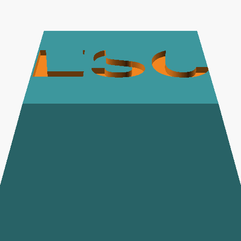

# Keycap Foundry

Parametric MX-compatible keycap library designed for **lost-wax silver casting**.
Written in OpenSCAD, validated with `trimesh`, previewed in a Three.js gallery.



## What this is

A code-defined keycap that you can:
- regenerate at any size (1u, 1.25u, ..., 6.25u spacebar)
- engrave with any text (currently Helvetica Bold, easily swappable)
- hollow with a uniform wall (default 1.0 mm, configurable down to 0.8 mm)
- export as a watertight, manifold STL ready for casting

The included `production/` folder ships an **ESC keycap** (1u, flat top, Cherry R1
height, Hollow 1.0mm wall) — both at design dimensions and with **+1.8% shrink
compensation** applied for silver lost-wax casting.

## Why parametric over CAD

Keycaps need precision (the MX cross slot is 0.05 mm tolerance) but very little
artistic curvature. That makes them a perfect fit for code-defined modelling:
change a variable, rebuild in 100 ms. No CAD license, no GUI clicks.

## Layout

```
keycap.scad          Parametric library (single file, all features)
analyze.py           STL → manifold check + volume + silver weight + cost
build_manifest.py    Regenerate manifest.json for the gallery
gallery.html         Three.js viewer with 4 view presets (front/top/bottom/iso)
index.html           Landing page → links to gallery, spec sheet, GIF, slicer guide
out/                 Generic flat-top hollow demos (1.0 & 0.8 mm wall)
production/          ESC keycap deliverable set
  ├── *_design.stl   Exact dimensions — for slicer / PLA test print
  ├── *_cast.stl     +1.8% upscale — what you give to the silver caster
  ├── *_cutaway.stl  Half-section for showing internal structure
  ├── spec_sheet.html  Printable A4 dimension drawing (browser → PDF)
  ├── ESC_rotation.gif  3-second 360° preview
  ├── ESC_SPEC.md    Plain-text spec (for email body)
  └── SLICER_CHECK.md  Pre-print checklist for FDM / resin
```

## Quick start

```bash
# Prerequisites
brew install --cask openscad@snapshot      # ARM-native OpenSCAD
python3 -m pip install --user numpy trimesh

# Generate an ESC keycap
openscad \
  -D 'flat_top=true' -D 'hollow=true' -D 'wall_thickness=1.0' \
  -D 'profile="cherry"' -D 'row=1' -D 'legend="ESC"' -D 'legend_size=4.5' \
  -o ESC.stl keycap.scad

# Validate + estimate silver weight & cost
python3 analyze.py ESC.stl

# Preview the gallery
python3 -m http.server 8765
# → open http://localhost:8765/
```

## Key parameters (`keycap.scad`)

| Parameter | Default | Notes |
|---|---|---|
| `key_units` | `1.0` | 1, 1.25, 1.5, 1.75, 2, 2.25, 6.25 |
| `profile` | `"cherry"` | `cherry` · `oem` · `sa` · `dsa` · `xda` |
| `row` | `3` | R1..R4 — only affects height on sculpted profiles |
| `hollow` | `false` | Open-bottom hollow shell with + stem |
| `wall_thickness` | `1.0` | Uniform wall (sides + top); 0.6 mm castable minimum |
| `flat_top` | `false` | Override the profile dish for a fully flat top |
| `legend` | `""` | Text to engrave (empty = none) |
| `legend_size` | `7` | Font height in mm |
| `legend_depth` | `0.45` | Engrave depth in mm |
| `shrink_compensation` | `1.0` | Use `1.018` for silver casting (1.8% upscale) |
| `cutaway` | `false` | Slice in half along XZ plane (for visualization) |

## Casting workflow

1. Open `production/spec_sheet.html` in a browser, print → PDF.
2. PLA-print `*_design.stl` at a local print shop (~₩3–5k) → fit on an MX
   switch, verify dimensions.
3. Hand the silver caster the `*_cast.stl` file + the spec sheet PDF.
   Common path in Korea: 종로 주얼리 거리's lost-wax casters (₩20–50k/cap
   casting fee on top of silver material cost).
4. Optional: rhodium plating to prevent tarnish (~₩5–10k/cap).

## Design choices

- **Open bottom** — required so wax can drain during burnout and silver can
  fill cleanly. Also standard for injection-molded keycaps.
- **+-shaped stem with no end caps** — minimum material, matches the standard
  4-pillar layout you see in commercial cast/plated keycaps.
- **Uniform wall** — top wall follows the dish curve (or stays flat) so the
  wall is exactly `wall_thickness` everywhere — easier for casters to quote.
- **Cross slot extended to underside of top wall** — saves material in the
  stem while still grabbing the MX switch via the full 4 mm cross arms.

## License

MIT — see [LICENSE](LICENSE). Use, modify, sell, fork — go ahead.

## Acknowledgements

- Reference for MX dimensions and standard keycap construction:
  [rsheldiii/KeyV2](https://github.com/rsheldiii/KeyV2)
- Built with Claude Code (Opus 4.7) — see commit log for the design iteration.
